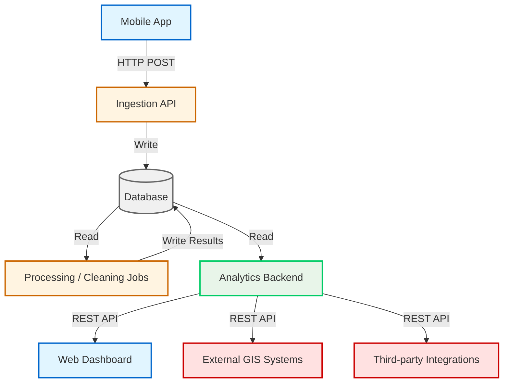
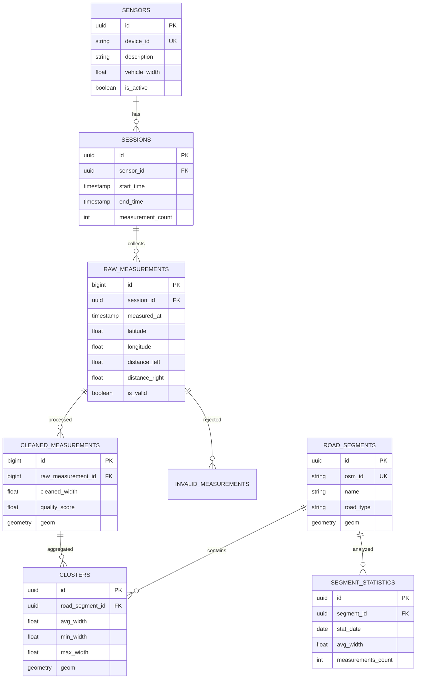

# ClearWay

**ClearWay** is a comprehensive system for **road passability analysis and visualization** based on mobile sensor measurements.  
Developed as a continuation of a hackathon prototype and diploma theses at the **University of West Bohemia (FAV ZČU)** in collaboration with **SIT Port Plzeň** and **Faculty of Electrical Engineering (FEL)**.

---

## 🎯 Project Goals

ClearWay provides an end-to-end solution for:

- **Data Collection:** Real-time measurements from mobile sensors (vehicles)
- **Data Processing:** Cleaning, validation, and aggregation of sensor data
- **Visualization:** Interactive maps, heatmaps, and statistical dashboards
- **GIS Integration:** Seamless connection with municipal systems and OpenStreetMap
- **Decision Support:** Helping emergency services, municipalities, and stakeholders evaluate road passability

---

## 📂 Project Structure

The project is organized into **three main repositories** under the [`clearway-dev`](https://github.com/clearway-dev) organization:

| Repository | Description | Technologies |
|------------|-------------|--------------|
| **[clearway-data](https://github.com/clearway-dev/clearway-data)** | Mobile app for data collection and ingestion pipeline. Supports real and simulated sensor data. | Flutter, Python (Flask/FastAPI) |
| **[clearway-analytics](https://github.com/clearway-dev/clearway-analytics)** | Web application for analytics, statistics, and map visualization of road passability. | React, Python (Flask/FastAPI), Leaflet/Mapbox |
| **[clearway-infra](https://github.com/clearway-dev/clearway-infra)** | Infrastructure setup, database schema, Docker Compose, and deployment documentation. | PostgreSQL, PostGIS, Docker Compose |

---

## 🏗️ System Architecture



### Data Flow

1. **Data Collection:** Mobile App → Ingestion API → Database
2. **Processing:** Cleaning Jobs read raw data, validate, and write cleaned results
3. **Analytics:** Analytics Backend queries processed data
4. **Visualization:** Web Dashboard and external systems consume data via REST API

---

## 🗂️ System Modules

| Module | Description | Location |
|--------|-------------|----------|
| **Data Collection** | Mobile sensor data acquisition and simulation | `clearway-data` |
| **Data Ingestion API** | Backend for receiving, validating, and storing measurements | `clearway-data` |
| **Data Processing** | Cleaning, aggregation, outlier detection | `clearway-data` / `clearway-infra` |
| **Database Schema** | PostgreSQL + PostGIS data model | `clearway-infra` |
| **Analytics & Statistics** | Corridor width calculations, spatial and temporal aggregations | `clearway-analytics` |
| **Visualization Layer** | Interactive maps, heatmaps, filtering, dashboards | `clearway-analytics` |
| **GIS Integration** | Shapefile import, OSM integration, municipal GIS sync | `clearway-analytics` / `clearway-infra` |
| **Infrastructure** | Docker containers, CI/CD, deployment scripts | `clearway-infra` |

---

## 🗄️ Database Schema

### Entity Relationship Diagram



### Key Design Principles

- **Traceability:** Track data from raw measurements to final statistics
- **Scalability:** Support millions of measurements via partitioning and indexing
- **GIS Integration:** PostGIS geometries for spatial queries
- **Simplicity:** Minimal complexity, essential entities only

---

## 🛠️ Technology Stack

### Backend
- **Database:** PostgreSQL 15+ with PostGIS 3.3+
- **API:** Python (Flask/FastAPI), future migration to Spring Boot
- **Processing:** Python scripts, scheduled jobs (cron)

### Frontend
- **Web Dashboard:** React, Tailwind CSS
- **Mobile App:** Flutter
- **Maps:** Leaflet / Mapbox GL JS

### Infrastructure
- **Containers:** Docker, Docker Compose
- **CI/CD:** GitHub Actions (planned)
- **Monitoring:** pgAdmin, application logs

### Optional Enhancements
- **TimescaleDB** for time-series data
- **pg_partman** for automatic table partitioning

---

## 🚀 Getting Started

### Prerequisites
- Docker & Docker Compose
- PostgreSQL 15+ with PostGIS
- Node.js 18+ / Python 3.10+

### Quick Start

```bash
# Clone the infrastructure repository
git clone https://github.com/clearway-dev/clearway-infra.git
cd clearway-infra

# Start PostgreSQL + PostGIS
docker-compose up -d

# Initialize database schema
psql -h localhost -U clearway -d clearway -f schema.sql

# Clone and run data ingestion
git clone https://github.com/clearway-dev/clearway-data.git
cd clearway-data
# Follow repository-specific instructions

# Clone and run analytics dashboard
git clone https://github.com/clearway-dev/clearway-analytics.git
cd clearway-analytics
# Follow repository-specific instructions
```

---

## 📊 API Endpoints

### Data Ingestion
- `POST /api/measurements` - Submit new measurements from mobile app

### Analytics
- `GET /api/segments` - List all road segments
- `GET /api/segments/{id}/statistics` - Statistics for specific segment
- `GET /api/segments/{id}/history` - Historical trends for segment
- `GET /api/measurements/export` - Export measurements (CSV, GeoJSON)

### GIS Integration
- `GET /api/segments/geojson` - GeoJSON of all road segments
- `POST /api/webhooks/notify` - Webhooks for critical events

---

## 👥 Team & Collaboration

**Diploma Theses (2024/2025):**
- **Jan Vandlíček** – Analytics and data visualization (ClearWay Analytics)
- **Jakub Homolka** – Data collection and management (ClearWay Data)

**Partners:**
- **SIT Port Plzeň** – Project coordination and use case definition
- **FEL ZČU** – Sensor integration and technical collaboration

**Academic Supervisor:**
- Faculty of Applied Sciences, University of West Bohemia

---

## 📝 Documentation

Detailed documentation is maintained in each repository:

- [**clearway-data**](https://github.com/clearway-dev/clearway-data) – Mobile app, ingestion API
- [**clearway-analytics**](https://github.com/clearway-dev/clearway-analytics) – Dashboard, visualization
- [**clearway-infra**](https://github.com/clearway-dev/clearway-infra) – Database schema, deployment

---

## 🔬 Research & Development

### Current Phase: Proof of Concept (PoC)
- ✅ Mobile data collection
- ✅ Database schema design
- 🚧 Data cleaning pipeline
- 🚧 Web dashboard with map visualization
- 🚧 GIS integration

### Future Enhancements
- Machine learning for anomaly detection
- Real-time processing with Kafka/streaming
- Multi-city deployment
- API for third-party integrations

---

## 📜 License

This project is currently under a **research prototype license**.  
Future licensing and distribution will be defined after the PoC phase and thesis defense.

---

## 🤝 Contributing

This is an academic research project. External contributions are currently not accepted.  
For questions or collaboration inquiries, please contact the project team through the organization.

---

## 📧 Contact

**GitHub Organization:** [github.com/clearway-dev](https://github.com/clearway-dev)  
**Project Maintainers:**
- Jan Vandlíček (Analytics)
- Jakub Homolka (Data)

---

**Last Updated:** October 13, 2025
